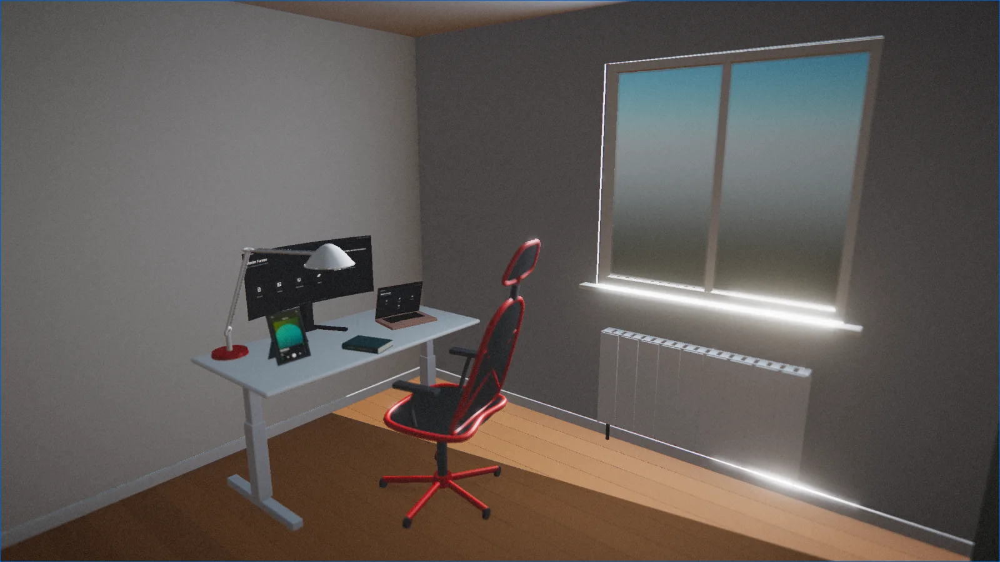
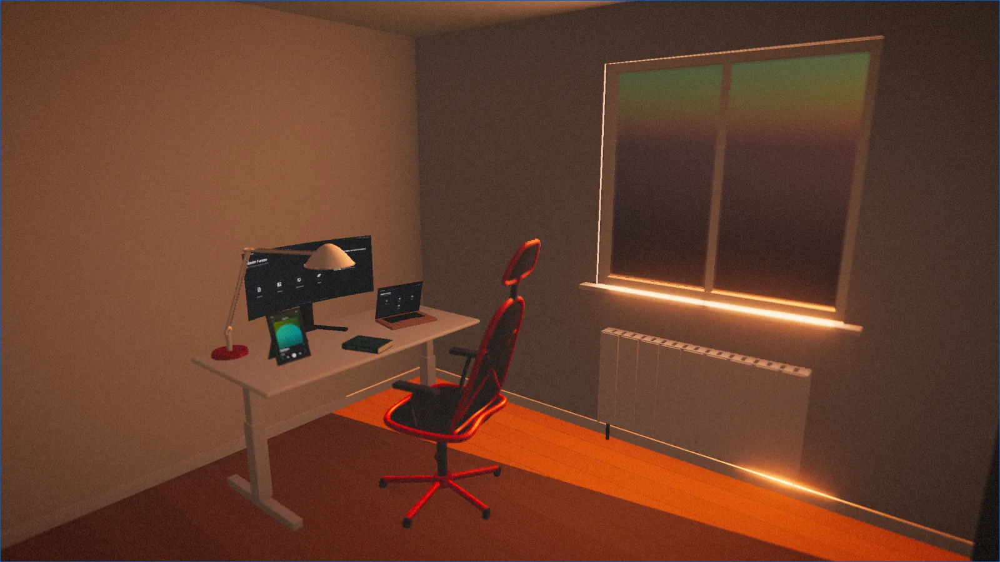
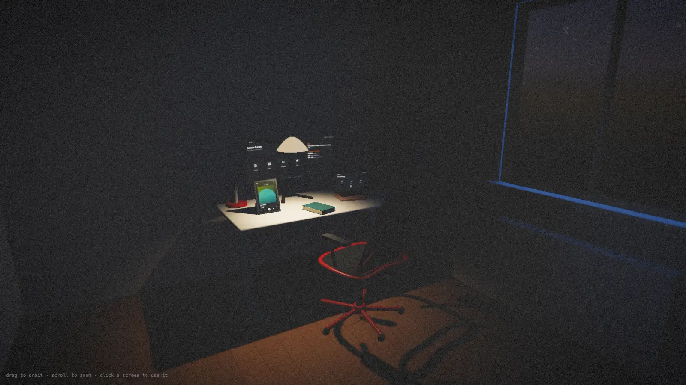
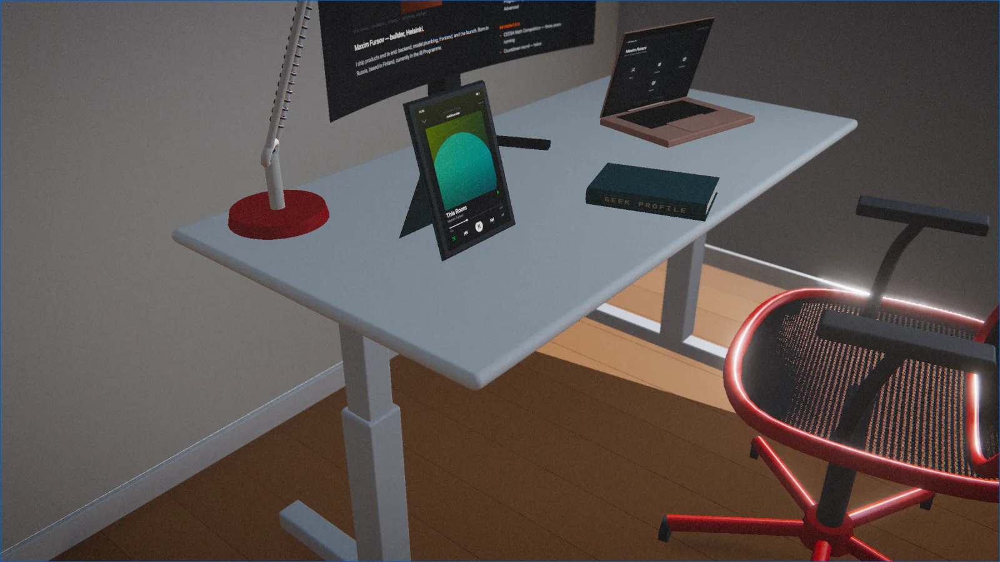
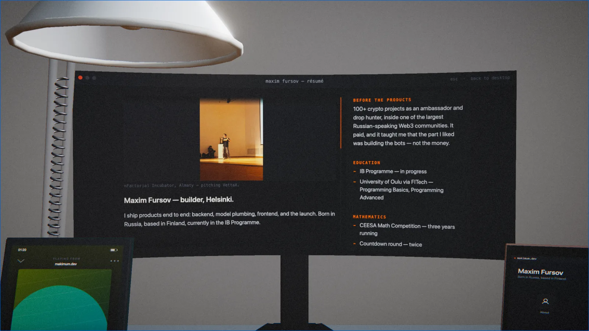

<p align="center">
  
</p>

<h1 align="center">makimum.dev</h1>

<p align="center">
  <b>A portfolio that is a room.</b><br>
  Every object in it is generated by code. Not one downloaded 3D asset.
</p>

<p align="center">
  <a href="https://makimum.dev"><b>Live site</b></a>
  &nbsp;·&nbsp;
  <a href="#how-it-works"><b>How it works</b></a>
  &nbsp;·&nbsp;
  <a href="ARCHITECTURE.md"><b>Architecture</b></a>
  &nbsp;·&nbsp;
  <a href="CONTRIBUTING.md"><b>Contributing</b></a>
</p>

<p align="center">
  
  
  
  
  
  
</p>

---

## The constraint

The desk, the monitor, the laptop, the mesh chair, the anglepoise lamp, the
radiator, the parquet floor, the book, the tablet — all of it is
`BufferGeometry` assembled at runtime from rounded boxes, lathes, tubes and
splines. There is **no `.glb`, no `.fbx`, no baked texture, and no image
in the bundle**. The chair's mesh fabric is a fragment shader. The page edges
of the book are a fragment shader. The album art on the tablet is drawn to a
canvas from a hash of the track title.

That constraint is the whole project. It is also why the bundle is 342 KB
gzipped for a fully lit interior scene, and why every visual decision has to
be argued in code rather than bought in a store.

<table>
  <tr>
    <td width="50%"></td>
    <td width="50%"></td>
  </tr>
  <tr>
    <td align="center"><sub><b>20:55</b> — golden hour</sub></td>
    <td align="center"><sub><b>01:20</b> — the lamp turns itself on</sub></td>
  </tr>
</table>

The sky is real. It runs a Preetham model against the actual solar position
for Helsinki and pulls live cloud cover and precipitation from Open‑Meteo, so
the room you get depends on when you visit it and what the weather is doing.

---

## How it works

### The screens are real interfaces



The monitor and the laptop each run a small operating system drawn to a
`<canvas>` and mapped onto curved geometry: a desktop, app windows, scrolling
documents, a photo gallery, a slide deck — and a full Tetris implementation
that you can actually play. Clicks are routed through the raycast `uv`
coordinate into the exact rectangles the painter returned when it drew the
frame, so hit regions cannot drift away from the pixels.



### The tablet plays real music

The tablet runs a music player whose track comes from the Spotify Web API —
what is actually playing, right now, with the progress head advancing in real
time between polls. The album art stays **procedural**, generated from a hash
of the real track title, because a cover fetched from someone else's servers
would make the *zero assets* line on the front page untrue.

The refresh token is a credential, so the call happens server-side in a
Cloudflare Pages Function (`functions/api/now-playing.ts`), and only the
fields the screen actually draws come back. Without the environment variables
the endpoint returns `204` and the room plays a built-in track — a fork works
out of the box and shows nothing broken.

To wire up your own:

```bash
# 1. developer.spotify.com/dashboard → Create app
#    Redirect URI exactly: http://127.0.0.1:8888/callback
export SPOTIFY_CLIENT_ID=… SPOTIFY_CLIENT_SECRET=…
node scripts/spotify-auth.mjs      # one-time, prints a refresh token

# 2. store all three as Pages secrets (never in the repo)
bunx wrangler pages secret put SPOTIFY_CLIENT_ID     --project-name=<project>
bunx wrangler pages secret put SPOTIFY_CLIENT_SECRET --project-name=<project>
bunx wrangler pages secret put SPOTIFY_REFRESH_TOKEN --project-name=<project>
```

Scopes requested: `user-read-currently-playing` and
`user-read-recently-played`. Read-only, no playback control, no library
access — the token cannot change anything in the account.

### Every number on screen is measured

The room shows its own triangle count and bundle size. Neither is typed in by
hand: the triangle count is computed by walking the scene graph at startup,
and the bundle size is read off the build report and asserted after each
build. When a label said `draw calls per frame` while the counter behind it
was measuring a single pass, the label was changed — not the number.

### The frame budget is measured too

The scene used to run **three geometry passes plus two shadow-map rebuilds
every frame**. The shadow map was being rebuilt at 60 Hz for a room where the
sun never moves, and the ambient-occlusion pass was rendering the whole scene
a second time just to get normals it could have been handed.

| 1440 × 900, overview camera | before | after |
| --- | --- | --- |
| Geometry passes per frame | 3 | **2** |
| Shadow-map rebuilds per frame | 2 | **0** |
| Draw calls per frame (day / night) | 799 / 1003 | **379 / 379** |
| Triangles submitted per frame | 328,783 | **157,483** |
| GPU headroom before 60 fps breaks | 1.0× | **1.5×** area |

The image is unchanged, and that is a measurement rather than a claim: both
paths were built side by side and compared with a frame signature — mean
difference 0.066, maximum 1 of 255, i.e. eight-bit rounding.

---

## Run it

Requires [Bun](https://bun.sh). No other global tooling.

```bash
bun install
bun run dev      # http://localhost:5178
```

```bash
bun run check    # typecheck + three headless suites (page tree, Tetris rules, palette)
bun run build
```

There is no test framework and no plan to add one. `bun run check` runs
`tsc --noEmit` plus three plain scripts that assert real invariants without a
browser — Tetris rule correctness and frame-rate independence, landing-page
structure, and the room's colour palette.

### Debug hooks

Open the console on the live scene:

```js
setSkyTime('2026-12-21T12:00')   // scrub the sky; no argument restores real time
setWeather({ cloudCover: 0.8, code: 71, precipitation: 1.2 })
lamp()                            // click the lamp (and take it off automatic)
measure('chair')                  // bounding box of any named object
profile(4)                        // geometry passes, draw calls, triangles, p50/p99
stress()                          // how far the render can scale before 60 fps breaks
grab()                            // frame signature, for before/after comparison
```

---

## Layout

```
src/
├─ main.ts            scene assembly, lighting, the frame loop
├─ constants.ts       every dimension and colour in the room
├─ room/shell.ts      floor, walls, ceiling, window, skirting
├─ props/             desk · monitor · macbook · chair · lamp · radiator · book · tablet
├─ screens/           the canvas operating system, Tetris, the music player
├─ sky/               solar position, Preetham sky, live weather
├─ post/              GTAO, bloom, grade, depth of field
├─ bake/              vertex-baked global illumination (offline)
├─ page/              the mobile landing page
└─ lib/               geometry primitives, materials, shaders, profiler, checks
```

[ARCHITECTURE.md](ARCHITECTURE.md) explains what lives where and why.

---

## Using this yourself

The code is MIT. **The content is not** — the résumé text, the photographs,
the CV, the gallery screenshots and the biography belong to Maxim Fursov.
Fork the room, keep the engine, replace everything in `src/screens/content.ts`,
`docs/resume.md` and `public/` with your own. See [LICENSE](LICENSE).

If you build something with it, an issue or a link would be welcome.

---

## Notes for readers of the source

Code comments are in **Russian** and they explain *why*, not *what* — the
reasoning behind a threshold, the measurement that produced a constant, the
bug that a line prevents. Visitor-facing text is English. This is deliberate
and documented in [CONTRIBUTING.md](CONTRIBUTING.md).

<p align="center"><sub>
Built in Helsinki · <a href="https://makimum.dev">makimum.dev</a>
</sub></p>
