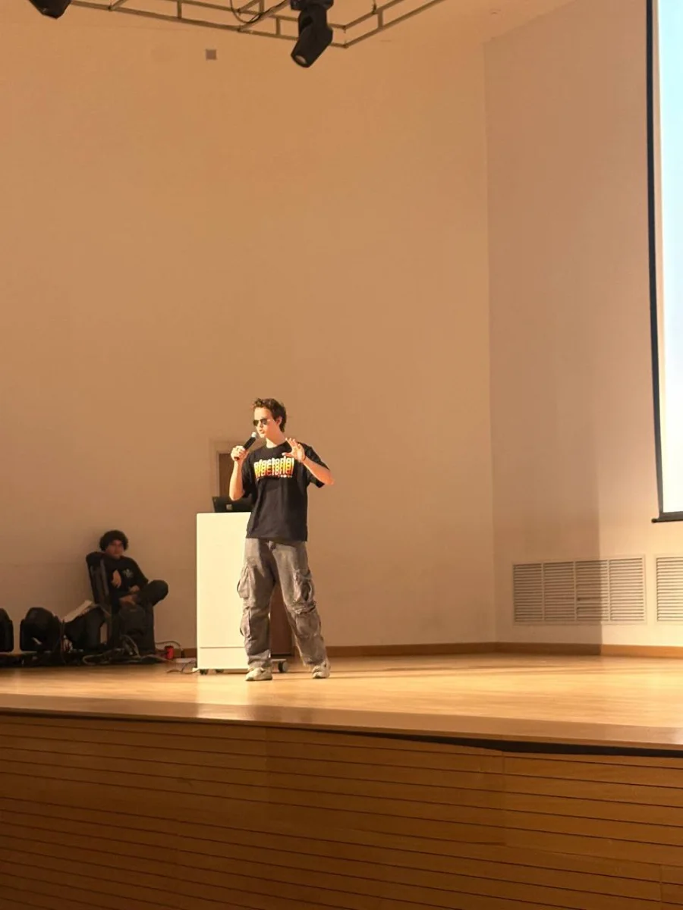

# Maxim Fursov

Builder. Helsinki, Finland.
maxfurs2008@gmail.com · github.com/Makimum · x.com/makimum_dev

I ship products end to end: backend, model plumbing, frontend, and the launch.
Born in Russia, based in Finland, currently in the IB Programme.

{width=42%}

---

## VettaX — co-founder

**vetta-x.com · 2026**

AI growth agent for X and LinkedIn. It watches the accounts you pick, drafts
replies and posts in your voice, and publishes only after you approve. Built
with a co-founder in a month, after a full pivot.

| | |
|---|---|
| Active users, 30 days | 601 |
| Views on the launch post | 187,700 |
| Peerlist upvotes | 124 |
| First revenue | $202 |

- Peerlist Launchpad — **#16 of the week**, Best B2C SaaS
- **3rd place, AFM AI Hackathon** — the largest AI-security hackathon in Kazakhstan
- Pitched at **nFactorial Incubator '26** demo day, Almaty
- Around 200 clients, 2 signed companies

**Stack:** Python, FastAPI, Postgres + pgvector, Redis / ARQ, React 19, TanStack.

The hard part was never the model. X answers a reply with 403 when the token is
wrong and 403 when the surface is wrong, and the two look identical. Proving the
gate was per-surface rather than per-account took correlating twelve publish
attempts against their targets.

---

## RiseFaceit

**Telegram mini-app system**

Joined a friend's project and built the mini-app system behind it. My first
product with real users and real money: **10,000 users**.

---

## RookieAI

**First project. Non-commercial, and that was the point.**

An AI copilot for picking a university, aimed at IB and A-Level students. No
revenue, no plan — the one I built to find out whether I could.

---

## makimum.dev

**This site, and the room it is made of**

A procedural 3D room in the browser. No purchased assets, no GLB files, zero
bytes of geometry in the bundle. Global illumination is path-traced in the
browser and baked into vertex colours. The sky outside the window is the real
Helsinki sky, computed from the sun's actual position — at midwinter noon the
sun sits at 6 degrees and the room spends the whole day in golden hour, because
that is what actually happens at 60 degrees north.

77,140 triangles, 330 KB gzipped.

---

## Before the products

100+ crypto projects as an ambassador and drop hunter, inside one of the largest
Russian-speaking Web3 communities. It paid. It also taught me that the money was
never the part I liked — the part I liked was building the bots and the scripts.

---

## Education

- **IB Programme** — in progress
- **University of Oulu via FITech** — Programming Basics, Programming Advanced

## Mathematics

- **CEESA Math Competition** — three years running
- **Countdown round** — twice
- **3rd place**, team standings

## Languages and tools

Python, Java, TypeScript, React, FastAPI, Postgres, Redis, three.js.
